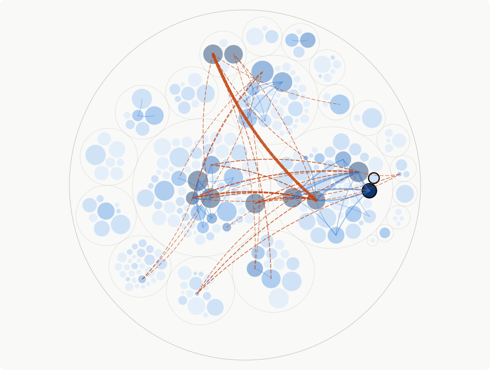

# Ivett's skills

Claude Code skills, distributed as a plugin marketplace. Add it once, then install whichever
you want:

```
/plugin marketplace add devill/ivetts-skills
```

---

## hotspot-rec

```
/plugin install hotspot-rec@ivetts-skills
```

Reads a git repository's history the way Adam Tornhill's *Your Code as a Crime Scene* does —
change frequency against file size, temporal coupling, fan-out — and turns it into **one**
design improvement: a long-term goal, and the smallest step toward it that is worth doing on
its own.

Not a report. Not a backlog. One thing to do next, with the evidence behind it and the
candidates it was chosen over.

Ask for it by name, or with *"where does our maintenance cost live?"*, *"run a hotspot
analysis"*, or by naming a file you dread touching.

### What it produces

A self-contained HTML page — offline, light and dark — with:

- the recommendation, goal and step first, evidence and corroboration underneath;
- an optional before/after diagram of the proposed change;
- the hotspot enclosure map, sized by lines and coloured by commits, with the target outlined;
- the temporal-coupling overlay with a live threshold slider;
- the comparison table, so you can see what was rejected and on what verified grounds.

The coupling map, from a real run on a 3D maze renderer:



Every circle is a production file — area is lines of code, colour is commits in the window —
and the outlined circles are packages. Every line joins two files that changed in the same
commit. **Orange dashed** means the pair crosses a package boundary: a change the architecture
claims is unrelated. Blue stays inside one package, where co-change is more often cohesion.

This is the view on load, deliberately chaotic. In the real page a slider raises the
co-change threshold, and what survives at the top is the coupling you actually pay for.

### How it decides

**The metrics nominate, they never decide.** Churn and coupling say where change lands; only
reading the code says why. The skill requires every candidate to be read before anything is
picked, and every dismissal to cite code rather than a hunch. "No change recommended" is a
legitimate answer.

The design question it asks of whatever the numbers surface: *where is the inappropriate
coupling that keeps bringing us back to this file, and do the dependencies at that seam point
the right way?* A codebase is healthy when a file changes for one reason and a change requires
understanding only a small part of the whole.

### The measurement

`scripts/forensics.py` is stdlib-only Python over `git log --numstat`, so it works on any
language.

- **Window** — the smallest span holding both ≥6 months and ≥5000 commits, or all history if
  the repo holds less. Commit rate varies with team size, so a fixed period samples a busy repo
  and a quiet one very differently.
- **Source files opt in.** Run without `--ext` and it lists the extensions the repo actually
  contains, with file and line counts, so you can name the language's source extensions
  yourself. Excluding known non-source cannot work: generated SVG, `.ai`, `.po` and minified
  bundles are all text, and each outranks real source on line count.
- **Packages at adaptive depth** — boundaries are detected by descending into directories while
  they are oversized, so packages come out comparable in size rather than at one fixed depth.
  Override them with `--packages` when they misread the architecture. Settle them before
  reading any history: boundaries chosen afterwards get drawn where they flatter a favourite.
- **Coupling is reported two ways** — degree (how tightly two files track each other) and
  distance (how many directory levels apart they sit). High degree between few partners is
  usually cohesion. Broad fan-out is the expensive shape, and it is why churn alone is a signal:
  every change to that file drags in understanding the others around it.

Run it directly if you want the raw tables:

```
python3 skills/hotspot-rec/scripts/forensics.py <repo>                  # what extensions are here?
python3 skills/hotspot-rec/scripts/forensics.py <repo> --ext .ts .tsx   # analyse
```

---

## learn

```
/plugin install learn@ivetts-skills
```

Reflect on the session that just happened, and put each learning where it will actually take
effect. Invoke it with `/learn`, *"what did we learn?"*, or when you catch yourself saying
*"from now on..."*.

The premise: an agent's memory is **recall-based**, so it works only if the right entry
surfaces at the right moment. Often something else is a better home. The skill reflects first,
then routes each learning through a fixed order, stopping at the first match:

1. **a deterministic hook** — for a recurring mistake a check can catch, because enforcement
   beats recall;
2. **CLAUDE.md** — for a static fact, convention or strong preference;
3. **a new skill** — for a reusable multi-step workflow;
4. **discard** — one-off, already written down, or too narrow to help later.

It shows you the exact change and asks before writing anything.

---

## build-project-review

```
/plugin install build-project-review@ivetts-skills
```

Builds a **repo-local `project-review` skill** for a codebase you contribute to, distilled from
its maintainers' review history, docs and enforced configs — so a first pass carries that
project's preferences before a human reads your diff.

The premise: a competent reviewer produces general good practice unprompted, so distilling it
buys nothing. Every candidate rule has to pass one test — *would a reviewer who has never seen
this project produce this finding anyway?* — and the ones that survive are the delta: the
invariants that make a reasonable-looking change wrong, the places the project deliberately does
what a reviewer would flag, and the proposals that were argued and rejected.

### How it works

1. **Discover** what the repo exposes — configs, `CONTRIBUTING`, ADRs, issue and PR history —
   and ask which sources to use.
2. **Harvest** the maintainers' writing into a JSONL corpus, including inline review comments
   and PR review bodies, via a script that ships with the generated skill for refreshing later.
3. **Distil** it in parallel sub-agents, one per chronological chunk, each returning imperative
   rules with a severity, a remedy and a verbatim quote.
4. **Verify** every quote against the corpus by machine, then strip the quotes — a rule that
   loses its quote was invented, not distilled.
5. **Generate** the review skill, install it, and trial it on a real change.

The generated skill reviews in three passes: once with no project context, once with the
principles loaded, and once attacking its own findings — so what the project adds is visible in
every review instead of buried among findings anyone would have made.

## Licence

MIT — see [LICENCE.md](LICENCE.md).
